                                                     


# Tema 12. API REST

[*1. Introducción.*](#_apartado1)

[*2. API REST utilizada. Comarcas*](#_apartado2)

[*3. Creación y Organización del Proyecto*](#_apartado3)

[*4. Creación de la Clase Comarca						6*](#_apartado4)

[*5. Creación del Controlador.*](#_apartado5)

[*6. Formulario*](#_apartado6)


# <a name="_apartado1"></a>1. Introducción.

En este tema vamos a ver de manera práctica una introducción al acceso a una API REST desde un formulario de Visual Studio.

Una API REST es una interfaz de comunicación entre sistemas de información que usa el protocolo de transferencia de hipertexto (hypertext transfer protocol o HTTP, por sus siglas en inglés) para obtener datos o ejecutar operaciones sobre dichos datos en diversos formatos, como pueden ser XML o JSON.

En nuestro tema simplemente vamos a iniciarnos en el acceso GET a través de http recopilando información de una página web que ofrece este servicio API REST.


# <a name="_apartado2"></a>2. API REST utilizada.

Vamos a ver dos ejemplos de llamadas API para entender en primer lugar que datos queremos manejar.

Por ejemplo, podemos hacer una llamada a esta dirección:

<https://node-comarques-rest-server-production.up.railway.app/api/comarques/provincies>

Al poner esa dirección http en nuestro navegador obtendríamos un resultado parecido a este, en el que nos aparecen las tres provincias de nuestra comunidad:

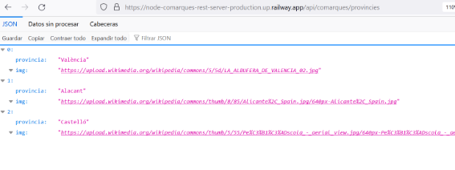

La dirección que vamos a utilizar nosotros es una que, incorporando el nombre de la provincia, nos devolvería información sobre las comarcas de esa provincia (el nombre y un enlace a una foto):

<https://node-comarques-rest-server-production.up.railway.app/api/comarques/comarquesAmbImatge/Alacant>

<https://node-comarques-rest-server-production.up.railway.app/api/comarques/comarquesAmbImatge/València>

<https://node-comarques-rest-server-production.up.railway.app/api/comarques/comarquesAmbImatge/Castelló>

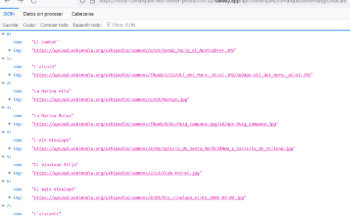

# <a name="_apartado3"></a>3. Creación y Organización del Proyecto

En este apartado vamos a empezar a crear nuestro proyecto e ir organizando para poder acceder a la API.

Una vez creado el proyecto vamos a crear, en el Explorador de Soluciones, tres carpetas (Models, Controllers y Views).

En la carpeta **Views** meteremos los ficheros relacionados con interfaz. En nuestro caso el Formulario.

En la carpeta **Models** crearemos las clases que nos permitan recuperar la información de la API.

En la carpeta **Controllers** meteremos aquellos elementos que nos sirvan como controlador o enlace entre los datos (el modelo) y la interfaz.

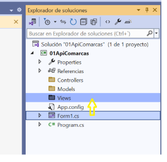

Vamos, en este apartado a empezar a crear la interfaz de nuestro Formulario.

Para ello, en nuestro formulario vamos a meter los siguientes controles:

- Un comboBox en el que posteriormente tendremos el nombre de las tres provincias (Alacant, València y Castelló). Le llamaremos `cmbProvincias`.
- Un listBox en el que introduciremos la lista de nombres de las comarcas pertenecientes a la provincia que elijamos. Se llamará `lsbComarcas`.
- Además, tendremos un label y un linkLabel en el que mostraremos el nombre de la comarca y un enlace a su imagen cuando elijamos una comarca en la lista.  `lblNombreComarca` y `lnkImagenComarca`.

Tendrá un aspecto similar al siguiente:

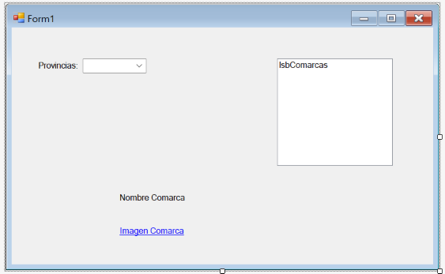


# <a name="_apartado4"></a>4. Creación de la Clase Comarca

A continuación, vamos a crear el modelo de datos que nos permitirá cargar los datos de la API y trabajar con ellos.

Para ello abrimos en nuestro navegador la petición a la API, por ejemplo, con la provincia de Alacant:

<https://node-comarques-rest-server-production.up.railway.app/api/comarques/comarquesAmbImatge/Alacant>

Apareciendo en nuestro navegador el JSON con los datos solicitados.

Si pulsamos en Datos sin procesar nos aparece:

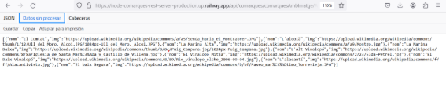

En este momento **seleccionamos y copiamos** un elemento individual (correspondería a una sola comarca):

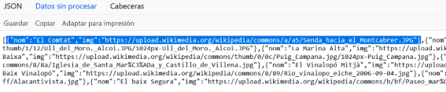

En nuestro navegador nos vamos a la [página JSonToCSharp](https://json2csharp.com/) y en ella **pegamos** y pulsamos Convertir:

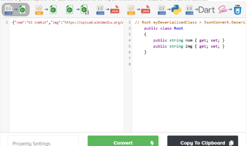

De esta manera obtenemos la clase que luego utilizaremos. 

Nos vamos a nuestra carpeta Models y en ella creamos una nueva Clase que llamaremos Comarca y que adaptaremos con el código que hemos obtenido en la página anterior:

```csharp
namespace _01ApiComarcas.Models
{
    public class Comarca
    {
        public string nom { get; set; }
        public string img { get; set; }
    }
}
```


# <a name="_apartado5"></a>5. Creación del Controlador.

En este apartado vamos a crear la clase **ComarcasController**, dentro de la carpeta Controllers.

Tendrá el siguiente código:

```csharp
public class ComarcasController
{
    // Variable local que nos permite realizar 
    // solicitudes HTTP
    private HttpClient _httpClient;

    // Constructor
    public ComarcasController()
    {
        _httpClient = new HttpClient();
    }
         
    // Método asincrono que realiza la petición a la API
    public async Task<List<Comarca>> GetComarcas(String provincia)
    {
        try
        {
            List<Comarca> listaComarcas = new List<Comarca>();

            // Hacemos la petición al servidor api
            HttpResponseMessage response = await _httpClient.GetAsync("https://node-comarques-rest-server-production.up.railway.app/api/comarques/comarquesAmbImatge/" + provincia);

            // Inicia una excepción si la respuesta http es false
            response.EnsureSuccessStatusCode();

            // Si la respuesta ha sido true (no salta la excepción)
            // Recogemos el JSON devuelto con los datos
            string responseJSON = await response.Content.ReadAsStringAsync();

            // Deserializamos el JSON obtenido a nuestro modelo
            // convirtiendolo en una lista de comarcas. 
            // Debemos instalar el paquete con Alt+Enter
            listaComarcas = JsonConvert.DeserializeObject<List<Comarca>>(responseJSON);

            return listaComarcas;
        }
        catch (Exception)
        {
            return null;
        }
    }
}
```


Para poder utilizar JsonConvert, que nos aparece con error, debemos instalar **NewtonSoft.Json**. Para ello pulsamos Alt + Intro e instalamos el paquete:

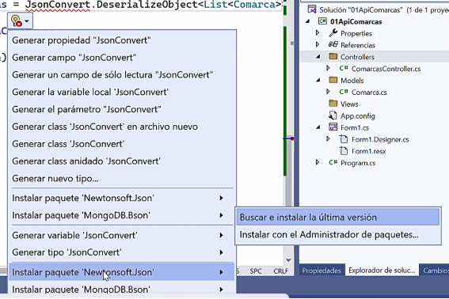

Como podemos ver en el código, lo que estamos haciendo es una petición http que nos devuelve una respuesta (`response`).

Si la respuesta ha sido correcta, obtenemos un string con el JSON (`responseJSON`), y la deserializamos para obtener la lista de Comarcas.


# <a name="_apartado6"></a>6. Formulario

Vamos, por último, a ver el código que **escribimos en nuestro formulario** para poder ver las comarcas de las distintas provincias.

En primer lugar, vamos a hacer un subprograma, que posteriormente llamaremos en FormLoad para rellenar el comboBox de provincias:

```csharp
private void cargarProvincias()
{
    String[] listaProvincias = { "Alacant", "València", "Castelló" };

    // Inicializamos el combo con el vector de provincias
    cmbProvincias.Items.AddRange(listaProvincias);
    cmbProvincias.SelectedIndex = 0;
}
```

A continuación, creamos una lista de comarcas en el formulario (accesible desde todos los puntos del mismo) y un método para cargar, utilizando un objeto de tipo controlador, la lista de comarcas, a partir del nombre de la provincia:

```csharp
private async void cargarComarcas(String provincia)
{
    listaComarcas = await comarcasController.GetComarcas(provincia);
    
    // Cargamos en el listBox el nombre de las comarcas
    lsbComarcas.Items.Clear();
    foreach (Comarca comarca in _listaComarcas)
    {
        lsbComarcas.Items.Add(comarca.nom);
    }

    lsbComarcas.SelectedIndex = 0;
}
```

***
**Programación Asíncrona.**

Como vemos en la definición de la función anterior aparece la palabra reservada `async`. Esto hace que esa función se ejecute de manera **asíncrona**. 

Cuando consumimos un recurso externo a nuestro código (un fichero, una BD, un servicio online…), este puede tardar y retardar o incluso bloquear nuestra aplicación.

De esta manera, cuando llamamos a esta función, **el llamador no espera al retorno** de esta, sino que sigue ejecutando las líneas que tenga a continuación.

Es importante que todo el hilo de acontecimientos sea asíncrono, por eso el método `comarcasControler.GetComarcas` también lo es.

La palabra reservada `await` hace que el resto del código **dentro de la función asíncrona** espere a la respuesta de esa línea de código.

[Utilización de async y await](https://www.campusmvp.es/recursos/post/async-y-await-en-c-como-manejar-asincronismo-en-net-de-manera-facil.aspx)

[Operador await en C#](https://learn.microsoft.com/es-es/dotnet/csharp/language-reference/operators/await)
***


Ahora, para poder cargar las comarcas dependiendo de la provincia elegida en el `comboBox`, llamaremos a esa función a través del evento `selectedIndexChanged`:

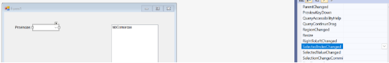

Como podemos ver si ejecutamos el programa, cuando cambiamos la provincia en el `comboBox` obtenemos en el `listBox` la lista de comarcas correspondientes.

Vamos, para finalizar el programa, a obtener en nuestro formulario (en `label` y `linkLabel` habilitados para ello) el nombre de la comarca y su imagen cuando la elijamos en el listBox de comarcas.

Hacemos una función que mostrará la comarca de una posición determinada y la llamaremos en el evento `SelectedIndexChanged` del listBox de comarcas:

```csharp
private void mostrarComarca(int pos)
{
    lblNombreComarca.Text = _listaComarcas[pos].nom;

    lnkImagen.Text = _listaComarcas[pos].img;

}

private void lsbComarcas_SelectedIndexChanged(object sender, EventArgs e)
{
    mostrarComarca(lsbComarcas.SelectedIndex);
    lnkImagen.LinkVisited = false;
}

```


Si queremos navegar al enlace de la imagen que aparece lo podemos hacer con el evento Click de linkLabel:

```csharp
private void lnkImagen_LinkClicked(object sender, LinkLabelLinkClickedEventArgs e)
{
    try
    {
        // Indicamos que lo hemos visitado
        lnkImagen.LinkVisited = true;
        // Abrimos navegador
        //System.Diagnostics.Process.Start(lnkImagen.Text);
        Process.Start(new ProcessStartInfo
        {
            FileName = lnkImagen.Text,
            UseShellExecute = true
        });

    }
    catch (Exception ex)
    {
        MessageBox.Show("Unable to open link that was clicked.");
    }
}

```

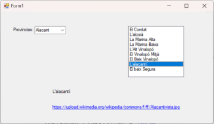

Código completo del formulario:
```csharp
public Form1()
{
    InitializeComponent();
}

private List<Comarca> _listaComarcas;
ComarcasController _comarcasController = new ComarcasController();

private void Form1_Load(object sender, EventArgs e)
{
    cargarProvincias();
}

private void cargarProvincias()
{
    String[] listaProvincias = { "Alacant", "València", "Castelló" };

    // Inicializamos el combo con el vector de provincias
    cmbProvincias.Items.AddRange(listaProvincias);
    cmbProvincias.SelectedIndex = 0;
}

private async void cargarComarcas(String provincia)
{
    listaComarcas = await comarcasController.GetComarcas(provincia);
    _listaComarcas = await 

    // Cargamos en el listBox el nombre de las comarcas
    lsbComarcas.Items.Clear();
    foreach (Comarca comarca in _listaComarcas)
    {
        lsbComarcas.Items.Add(comarca.nom);
    }

    lsbComarcas.SelectedIndex = 0;
}

private void cmbProvincias_SelectedIndexChanged(object sender, EventArgs e)
{
    cargarComarcas(cmbProvincias.Text);
}

private void mostrarComarca(int pos)
{
    lblNombreComarca.Text = _listaComarcas[pos].nom;

    lnkImagen.Text = _listaComarcas[pos].img;
}

private void lsbComarcas_SelectedIndexChanged(object sender, EventArgs e)
{
    mostrarComarca(lsbComarcas.SelectedIndex);
    lnkImagen.LinkVisited = false;
}

private void lnkImagen_LinkClicked(object sender, LinkLabelLinkClickedEventArgs e)
{
    try
    {
        // Indicamos que lo hemos visitado
        lnkImagen.LinkVisited = true;
        // Abrimos navegador
        Process.Start(new ProcessStartInfo
        {
            FileName = lnkImagen.Text,
            UseShellExecute = true
        });

    }
    catch (Exception ex)
    {
        MessageBox.Show("Unable to open link that was clicked.");
    }
}

private async void mostrarInfoComarca()
{
    //listaComarcas = await comarcasController.GetComarcas(provincia);
    ComarcaInfo comarcaInfo = await _comarcasController.GetComarcaInfo(lblNombreComarca.Text);

    MessageBox.Show(comarcaInfo.ToString());
}

private void btnInfoComarca_Click(object sender, EventArgs e)
{
    mostrarInfoComarca();
}
```


Se deja como ejercicio al alumno añadir un botón en el que según el nombre la comarca seleccionada accedamos a esta petición http obteniendo información sobre la misma:

<https://node-comarques-rest-server-production.up.railway.app/api/comarques/infoComarca/L'alacantí>


# <a name="_apartado7"></a>7. Api Rest The Movie DataBase

## The Movie DataBase
Vamos a realizar un ejercicio para trabajar con otra API Rest más completa y dinámica que la que hemos utilizado en el apartado anterior.

Esta API Rest es la de la página [The Movie DataBase](https://www.themoviedb.org/), en la que tenemos una completísima base de datos de películas y series.

Si queremos trabajar como programadores con esta API podemos empezar en la página: <https://developer.themoviedb.org/reference/intro/getting-started>, en ella aparecen a la izquierda los distintos endpoints que podemos acceder.

Uno de ellos es el de las películas ahora mismo en cartelera:

<https://developer.themoviedb.org/reference/movie-now-playing-list>.

## Api Key
Para poder trabajar con esta API Rest necesitamos una **clave o API Key**, a diferencia con la API de comarcas que trabajamos en los apartados anteriores que no la necesitaban.

Si en la página [Get Starter](https://developer.themoviedb.org/reference/intro/getting-started) pulsamos sobre el botón Get Api Key:

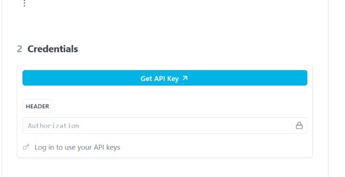

Nos pide que nos hagamos una cuenta y en ella tendremos que ir al apartado correspondiente:

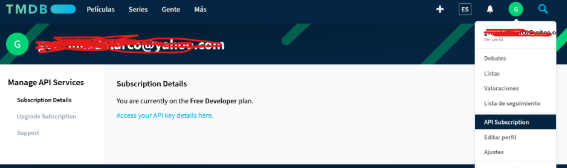

Tendremos que copiar luego nuestra API Key para poder acceder al endpoint deseado.

## Creación y organización del proyecto
De nuevo, como en el apartado anterior, crearemos un nuevo proyecto y en el mismo, crearemos las carpetas **Models, Controllers, Views**.

Vamos a crear a continuación el formulario principal en el que vamos a visualizar nuestras películas. Tendrá un aspecto similar a este:

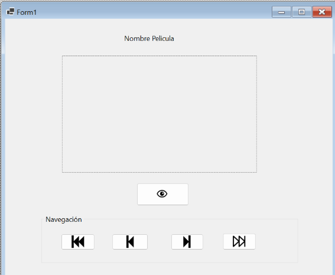

Siendo un elemento de tipo PictureBox el rectángulo que aparece en medio y que nos permitirá ver la portada de la película.

**Creación de la clase Película.**

Vamos a crear a continuación la clase película, que al igual que hacíamos antes con las comarcas me permite trabajar con un elemento de tipo Película.

Para ello, en primer lugar vamos a ver la estructura JSON que nos devuelve la petición API a The Movie Database, con las películas en cartelera.

Para ello, lo podemos hacer en el navegador, o bien en el programa [Postman](https://www.postman.com/), utilizando la siguiente url, en la que debemos incorporar el idioma y la API_Key:

<https://api.themoviedb.org/3/movie/now_playing?api_key=API_KEY&language=es>

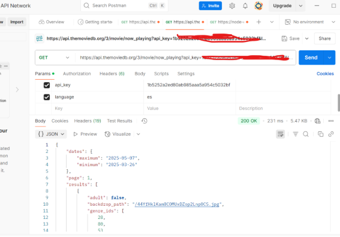


Vemos que el resultado JSON nos ofrece información, así como una lista de películas que es la que nos interesa (uno de sus elementos) para utilizar en [Json2CSharp](https://json2csharp.com/) para poder crear la clase **Película** en **Models**:

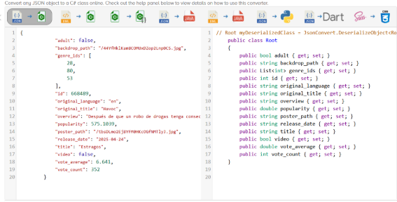

Dando como resultado la clase **Models/Película**:

```csharp
public class Pelicula
{
    public bool adult { get; set; }
    public string backdrop_path { get; set; }
    public List<int> genre_ids { get; set; }
    public int id { get; set; }
    public string original_language { get; set; }
    public string original_title { get; set; }
    public string overview { get; set; }
    public double popularity { get; set; }
    public string poster_path { get; set; }
    public string release_date { get; set; }
    public string title { get; set; }
    public bool video { get; set; }
    public double vote_average { get; set; }
    public int vote_count { get; set; }
}

```

**Creación del controlador**

A continuación, vamos a crear **Controllers/PeliculasController** que nos permitirá acceder a la API y obtener una lista de películas.

Ponemos el código a continuación, recordando que se debe instalar el paquete **NewtonSoft.JSON**:

```csharp
public class PeliculasController
{
    // Variable local que nos permite realizar 
    // solicitudes HTTP
    private HttpClient _httpClient;

    private string _apiKey = "1bcambiarporlanuestrabf";

    public PeliculasController()
    {
        _httpClient = new HttpClient();
    }

    public async Task<List<Pelicula>> GetPeliculasNowPlaying()
    {
        try
        {
            string url = $"https://api.themoviedb.org/3/movie/now_playing?api_key={_apiKey}&language=es";

            HttpResponseMessage response = await _httpClient.GetAsync(url);

            response.EnsureSuccessStatusCode();

            string responseJSON = await response.Content.ReadAsStringAsync();

            JObject jsonObject = JObject.Parse(responseJSON);
            JArray resultsArray = (JArray)jsonObject["results"];
            List<Pelicula> peliculas = resultsArray.ToObject<List<Pelicula>>();

            return (peliculas);
        }
        catch (Exception)
        {
            return null;
        }
    }
}

```


**Programación de la Interfaz (Formulario)**

Este sería el código que tendríamos en nuestro formulario. Se han puesto los distintos eventos del mismo:

```csharp
public Form1()
{
    InitializeComponent();
}

PeliculasController peliculasController = new PeliculasController();
List<Pelicula> listaPeliculas = null;

int _posicion = 0;

private async void obtenerPeliculasActuales()
{
    listaPeliculas = await peliculasController.GetPeliculasNowPlaying();
    mostrarPelicula(_posicion);
}

// Esta función se llama cuando ya se hayan 
// Cargado las películas y carga la de pos
private async void mostrarPelicula(int pos)
{
    lblNombrePelicula.Text = listaPeliculas[pos].title;
    string size = "w500";
    string imageUrl = "https://image.tmdb.org/t/p/" + size + listaPeliculas[pos].poster_path; // Reemplaza con la URL de tu imagen

    try
    {
        HttpClient httpClient = new HttpClient();

        byte[] imageBytes = await httpClient.GetByteArrayAsync(imageUrl);
        using (var ms = new System.IO.MemoryStream(imageBytes))
        {
            pictureBox1.Image = System.Drawing.Image.FromStream(ms);
        }
    }
    catch (Exception ex)
    {
        MessageBox.Show("Error al cargar la imagen: " + ex.Message);
    }

}

private void Form1_Load(object sender, EventArgs e)
{
    obtenerPeliculasActuales();
}

private void btnPrimero_Click(object sender, EventArgs e)
{
    _posicion = 0;
    mostrarPelicula(_posicion);
}

private void btnAnterior_Click(object sender, EventArgs e)
{
    if (_posicion > 0)
    {
        _posicion--;
        mostrarPelicula(_posicion);
    }
}

private void btnSiguiente_Click(object sender, EventArgs e)
{
    if (_posicion < listaPeliculas.Count - 1)
    {
        _posicion++;
        mostrarPelicula(_posicion);
    }
}

private void btnUltimo_Click(object sender, EventArgs e)
{
    _posicion = listaPeliculas.Count - 1;
    mostrarPelicula(_posicion);
}

```